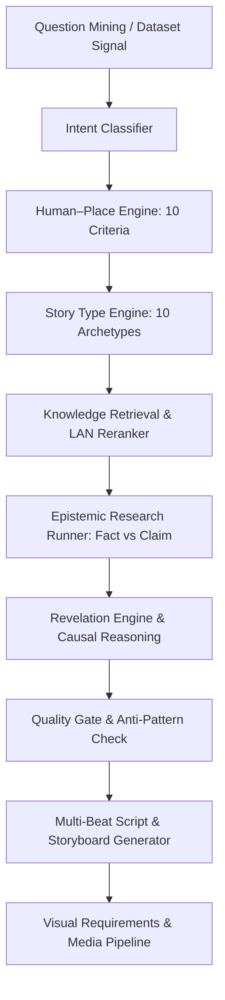

# 🏗️ System Architecture: Nugi Human–Place Content Intelligence Engine

## 1. Overview & Purpose

**Nugi Content Creator** adalah sistem kecerdasan editorial independen yang dirancang untuk:
1. **Discover questions:** Menemukan pertanyaan riil yang ingin dipahami manusia mengenai kehidupan nyata.
2. **Deep research:** Meriset pertanyaan tersebut menggunakan bukti empiris (data institusional, sejarah, laporan ekonomi).
3. **Map causal relationships:** Mengidentifikasi hubungan sebab-akibat antara manusia (*Human*) dan ruang tempat manusia hidup (*Place*).
4. **Contextualize changes:** Memahami perubahan dalam sejarah, ekonomi, teknologi, AI, kerja, budaya, geografi, kota, perumahan, dan lahan.
5. **Construct causal chains:** Membangun rantai kausal multi-tingkat (bukan sekadar korelasi dangkal).
6. **Distinctive storytelling:** Mengubah riset menjadi narasi khas persona Nugi (tenang, tajam, reflektif, non-sales, bernapas manusia).
7. **Multi-format scripts:** Menghasilkan naskah short-form (Shorts/TikTok/Reels) dan long-form (YouTube video esai).
8. **Visual/media planning:** Menghasilkan spesifikasi visual per micro-beat, query ekspansi aset, dan storyboard.
9. **Learning loop:** Belajar secara berkesinambungan dari performa konten untuk mengasah fit score dan topik masa depan.

---

## 2. Diagram Alur Sistem (System Dataflow)

---

## 3. Komponen Inti (Core Components)

### A. Editorial Intelligence (`engine/editorial/`)
- `taxonomy.py`: Klasifikasi 4 pilar utama (`human`, `place`, `change`, `why`) dan 12 sub-domain.
- `intent_classifier.py`: Pengklasifikasi intensi pencarian (15 kelas: historical, origin, economic, urban, dll.) yang memprioritaskan intensi substantif atas kata tanya generik.
- `human_place_engine.py`: Uji anchor 10 kriteria Human–Place dan deteksi rantai kausal kanonikal.
- `story_type.py`: Klasifikasi ke dalam 10 arketipe narasi beserta seleksi *narrative device* yang alami (kontradiksi bukan syarat wajib).
- `revelation_engine.py`: Penilai kualitas dan generator cetak biru momen epifani dengan penegakan rantai kausal dan penolakan kalimat klise AI.
- `fit_score.py`: Penghitung skor editorial fit multi-dimensi.
- `quality_gate.py`: 8 gerbang kualitas wajib dan 12 aturan penolakan mutlak (*hard rejections*).

### B. Ingestion & Retrieval (`engine/ingestion/` & `engine/providers/`)
- `embedding.py`: Abstraksi provider embedding lokal (LM Studio di `http://192.168.0.114:1234/v1/embeddings`) dengan fallback deterministik SHA-256 untuk testing.
- `reranker.py`: Abstraksi provider cross-encoder reranker (BGE-Reranker di `http://192.168.0.114:8080/v1/rerank`).
- `retriever.py`: Two-stage knowledge retriever (vektor kandidat top-k dilanjutkan reranking presisi).

### C. Pipeline Runner & CLI (`engine/pipeline/`)
- `engine_cli.py`: Antarmuka baris perintah (*unified CLI*) untuk mengoperasikan seluruh engine.
- `question_mining.py`: Ekstraksi pertanyaan dan klasterisasi semantik dari dataset eksternal opsional (`riset keyword.json`).
- `research_runner.py`: Eksekusi riset terstruktur dengan pemisahan epistemik tegas antara fakta terverifikasi (*evidence*) dan klaim/opini (*claims*).
- `video_pipeline.py`: Perencanaan produksi video (parsing script, alokasi micro-beats, spesifikasi visual, SRT, dan export proyek Kdenlive).
